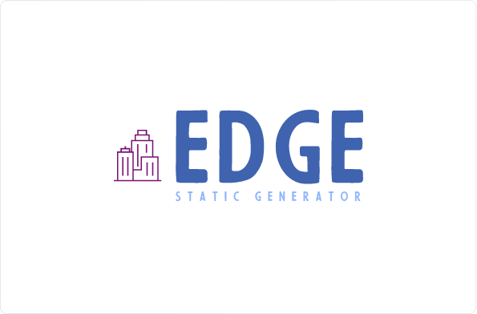

<div align="center">
  


</div>

# Edge

**Edge** is a new static generator.

**Edge is onworking. Do not clone or do any changes. No P.R will be merged**

Also **Edge** means: *the outside limit of an object, area, or surface*.

**This blog is using Edge static generator. This generator is not stable and this is just a concept. Main core and others are in another repository. This version is not same with the main Edge. This is just for tests. Do not edit anything.**

### What is exactly edge doing?

**Edge** is a simple static generator written in Python. **Edge** has no high level core or libraries. Up next, I will teach you how to use **Edge** for your blogs.

### How to download and setup a blog?

**Edge** stable version will be out soon. This is the first Concept of the program.

### How do I use Edge?

**Edge** is a command line program. There is no GUI version of it. When you install and config it, you are able to build your blog with these simple commands.

- **Create a post**

```shell
$ edge --new <name> <language>
```

When you want to create a post, you should use `--new` command. After `--new` enter the name and the language of the post.

If your post is an English post, use `--en` and if it is Persian, use `--fa`.

```shell
$ edge --new hello --fa
```

Other commands for **Updating** and others, will be wrote in **Edge** documentations. Now this project is not the stable and completed version. Just a part of the programm.

### How to config Edge?

There is a `config` directory that includes a `config.py` file. In this version, config file just has one value but in main version, you should add **time zone**, **Author** and other things. The main value is **Outout directory**. All of posts will be in output directory. So you should tell the app what is your output directory.

If you are using **Github Pages**, write `docs` in the value.

### What is the software structure?

```shell
├── out
│   ├── index.html
│   ├── posts
│   │   └── index.html
│   └── static
│       ├── css
│       │   ├── dark.css
│       │   ├── light.css
│       │   └── main.css
│       ├── font
│       │   ├── iransans
│       │   │   └── iransans.ttf
│       │   └── iransans.ttf
│       └── js
│           ├── script.js
│           └── toggle.js
├── config
│   └── config.py
├── files
│   ├── en.html
│   └── fa.html
├── LICENSE
├── main.py
└── README.md
```

So, Simple. `docs` dir is the **Output dir**. In `docs` we have 2 directories, `posts` and `static`. `posts` include all of the posts and the main page.

In `static` there are styles, js files, fonts.

Back in pre directory, `config` is the directory that has `config.py` file.

In `files`, there are 2 files. `fa.html` for Persian and `en.html` for English posts.

So, we all know what is `LICENSE` and `README`. The `main.py` is the **Edge** file.

**Remember. This version is not the main version. This is just for tests and people feedbacks**

### How to costumize a theme?

First, just create a simple template. I mean in your PC, create a directory, create an `index.html` and a static directory. Develop what you like. After, Move your `static` folder in `docs/static`. And put sample html files, in `files` directory.

Next, there will be some templates and how to create a template.

This project is licensed under **MIT License**.

Creator: Amirhossein Mohammadi. [Github](https://github.com/BlackIQ) | [BlackIQ.ir](https://blackiq.ir)
